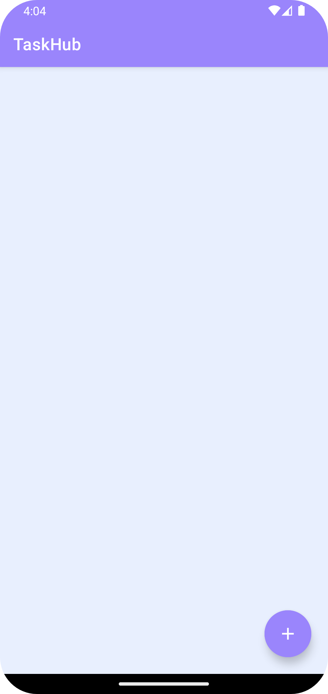
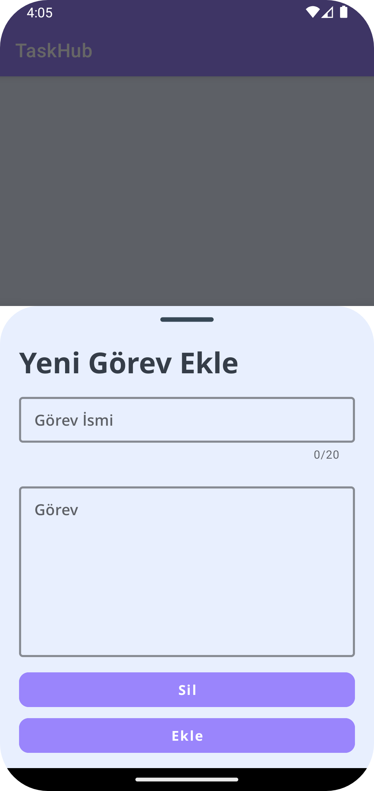
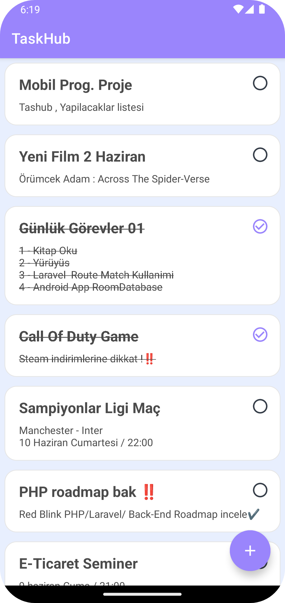
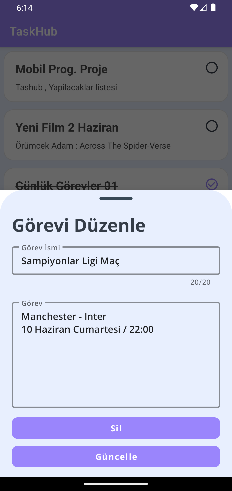

# TaskHub App

## 🌟 Hakkında
İşlerinizi halletmenize yardımcı olan basit yapılakcaklar listesi uygulamasıdır. Kotlin ile oluşturulmuş taskhub, eklenen bir görevi tamamlandı olarak işaretleyebilir. Görevleri not etmek için kullanılır ve görevleri güncelleyebilir veya silebilirsiniz. Room'u kullanarak da verileri yerel veritabanına kaydeder.

## ✨ Screenshots
&nbsp;
&nbsp;
&nbsp;
&nbsp;
&nbsp;
  

## 🚀 Kütüphaneler
* [Kotlin](https://kotlinlang.org)
* [Room DataBase](https://developer.android.com/training/data-storage/room)
* [Model-View-ViewModel(MVVM)](https://developer.android.com/topic/libraries/architecture/viewmodel)
* [LiveData](https://developer.android.com/topic/libraries/architecture/livedata)
* [View Binding](https://developer.android.com/topic/libraries/view-binding)
* [Data Binding](https://developer.android.com/topic/libraries/data-binding)
* [RecyclerView](https://developer.android.com/jetpack/androidx/releases/recyclerview)

